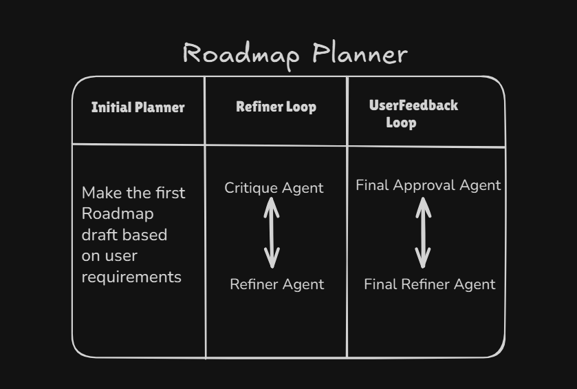

# Short Term Goal Planner

## Problem
Setting and achieving short-term goals can be overwhelming for many people as well as for me. I struggle to break down a high-level objective (like "Learn Python" or "Prepare for a Marathon") into a concrete, actionable daily schedule. Common issues include:
- **Overestimation**: Planning too much for one day.
- **Lack of Structure**: Not knowing the logical order of topics or tasks.
- **Time Management**: Failing to adjust the plan to fit actual daily free time.
- **Skill Mismatch**: Starting at a level that is too hard or too easy.

Also I want to have clear list of tasks that make me feel that I didn't waste my day.


## Solution
This project provides an automated **AI-powered Goal Planner** that acts as your personal productivity coach. By leveraging a multi-agent system, it generates a highly personalized, day-by-day roadmap tailored to your specific constraints.

The system:
1.  **Understands Context**: Takes your goal, total duration, daily free time, and current knowledge level as input.
2.  **Self-Corrects**: Uses an internal "Critique" agent to review the generated plan for realism and feasibility before you even see it.
3.  **Collaborates**: Allows you to review the draft and provide feedback, which the AI uses to refine the plan until you are satisfied.

## Architecture
The application is built using the **Google Agent Development Kit (ADK)** and orchestrates several specialized AI agents in a sequential pipeline.

!
### Agent Workflow
The system follows a `SequentialAgent` structure containing three main stages:

1.  **Initial Planner Agent** (`gemini-2.5-pro`)
    -   Generates the first draft of the roadmap based on user inputs.

2.  **Refiner Loop** (`LoopAgent`)
    -   *Iterates until the plan is solid.*
    -   **Critique Agent** (`gemini-2.5-flash`): Reviews the draft. If it finds issues (e.g., too much content for 1 hour), it provides feedback.
    -   **Plan Refiner Agent** (`gemini-2.5-flash`): Rewrites the roadmap to address the critique.

3.  **Final Refiner Loop** (`LoopAgent`)
    -   *Iterates until the user approves.*
    -   **Final Approval Agent** (`gemini-2.5-flash-lite`): Saves the roadmap to `draft_roadmap.md` and pauses to ask for your feedback via the terminal.
    -   **Final Refiner Agent** (`gemini-2.5-pro`): Incorporates your specific feedback (e.g., "Add more practice on weekends") into the final version.

## Setup Instructions

### Prerequisites
-   Python 3.9 or higher
-   A Google Gemini API Key

### Installation

1.  **Clone the repository** (or download the files).

2.  **Install dependencies**:
    ```bash
    pip install google-adk google-genai python-dotenv
    ```

3.  **Configure Environment Variables**:
    Create a file named `.env` in the root directory of the project. This file will store your sensitive API keys.

### Configuration (`.env`)

Copy the content below into your `.env` file:

```env
GEMINI_API_KEY=your_actual_api_key_here
```

## Usage

1.  Run the main script:
    ```bash
    python main.py
    ```

2.  **Enter your details** when prompted:
    -   **Goal**: e.g., "Learn Rust programming"
    -   **Duration**: e.g., "2 weeks"
    -   **Free Time**: e.g., "1 hour daily"
    -   **Current Knowledge**: e.g., "Intermediate Python developer"

3.  **Wait for the AI**: The system will generate a draft and refine it internally.

4.  **Review and Refine**:
    -   The script will save a file named `draft_roadmap.md`.
    -   Open this file to read the plan.
    -   In the terminal, type your feedback (e.g., "Make the weekends lighter") or type `APPROVE` to finish.
